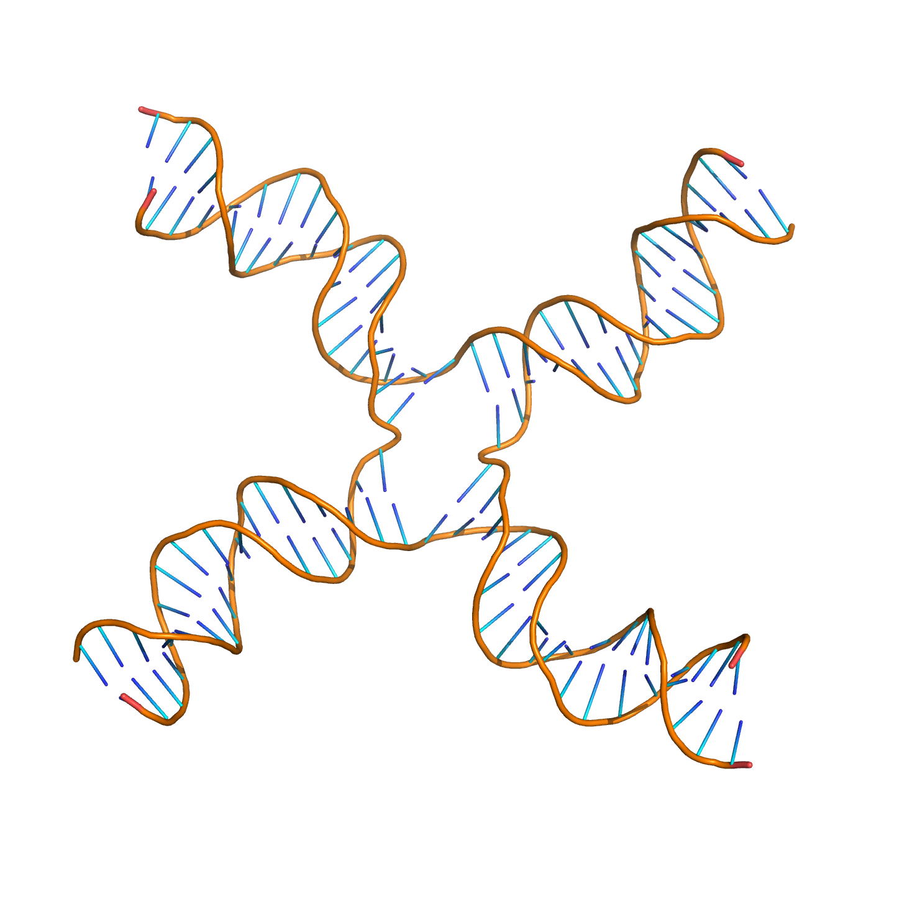

# Linkage And Gene Mapping
 
[Genetic linkage](https://en.wikipedia.org/wiki/Genetic_linkage) is the tendency of DNA sequences that are close together on a chromosome to be inherited together during the meiosis phase of sexual reproduction. Two genetic markers that are physically near to each other are unlikely to be separated onto different chromatids during chromosomal crossover, and are therefore said to be more linked than markers that are far apart. In other words, the nearer two genes are on a chromosome, the lower the chance of [recombination](https://en.wikipedia.org/wiki/Genetic_recombination) between them, and the more likely they are to be inherited together. Markers on different chromosomes are perfectly unlinked.

## Chromosomal crossover

[Chromosomal crossover](https://en.wikipedia.org/wiki/Chromosomal_crossover), or crossing over, is the exchange of genetic material between two homologous chromosomes that results in recombinant chromosomes during sexual reproduction. It is one of the final phases of genetic recombination, which occurs in the pachytene stage of prophase I of meiosis during a process called synapsis. Synapsis begins before the synaptonemal complex develops and is not completed until near the end of prophase I. Crossover usually occurs when matching regions on matching chromosomes break and then reconnect to the other chromosome.

Crossing over was described, in theory, by Thomas Hunt Morgan. He relied on the discovery of Frans Alfons Janssens who described the phenomenon in 1909 and had called it "chiasmatypie". The term chiasma is linked, if not identical, to chromosomal crossover. Morgan immediately saw the great importance of Janssens' cytological interpretation of chiasmata to the experimental results of his research on the heredity of Drosophila. The physical basis of crossing over was first demonstrated by [Harriet Creighton](https://en.wikipedia.org/wiki/Harriet_Creighton) and [Barbara McClintock](https://en.wikipedia.org/wiki/Barbara_McClintock) in maize ([*Zea mays subsp. mays*](https://en.wikipedia.org/wiki/Maize)) in 1931. She produced the first genetic map for maize, linking regions of the chromosome to physical traits. The maize genome sequence was published in 2009 in the journal [Science](https://science.sciencemag.org/content/326/5956/1112). 

(ref:maize) [Maize: (A) Lower part of the plant (B) top of plant with male inflorescense (C) middle of plant with female inflorescenses (D) ear/cob: (1) two pollen grains of a male inflorescense (3, 4) female flowers (5) female flowers with stigma (6) fruit bottom view (7) fruit side view (8) fruit cross-section views](https://commons.wikimedia.org/wiki/File:Zea_mays_-_K%C3%B6hler%E2%80%93s_Medizinal-Pflanzen-283.jpg)

```{r zeamays, fig.cap='(ref:maize)', echo=FALSE, message=FALSE, warning=FALSE}
knitr::include_graphics("./figures/linkage/Zea_mays_-_Köhler–s_Medizinal-Pflanzen-283.jpg")
```

Chromosomal crossover involves recombination between the paired chromosomes inherited from each parent during meiosis. During prophase I (pachytene stage) the four available chromatids are in tight formation with one another. While in this formation, homologous sites on two chromatids can closely pair with one another, and may exchange genetic information. The information transfer may occur without physical exchange (a section of genetic material is copied from one chromosome to another, without the donating chromosome being changed) (see SDSA pathway in Figure \@ref(fig:recombination)); or by the breaking and rejoining of DNA strands, which forms new molecules of DNA (see DHJ pathway in Figure  \@ref(fig:recombination)).

## Meiotic recombination


(ref:holli) Molecular structure of a Holliday junction (based on atomic coordinates of [PDB 3CRX](https://www.rcsb.org/structure/3crx)) rendered with open source molecular visualization tool PyMol.)

```{r holliday, fig.cap='(ref:holli)', echo=FALSE, message=FALSE, warning=FALSE}

```

Molecular models of meiotic recombination have evolved over the years as relevant evidence accumulated. A recent model that reflects current understanding was presented by Anderson and Sekelsky, and is outlined in Figure \@ref(fig:recombination)). The figure shows that two of the four chromatids present early in meiosis (prophase I) are paired with each other and able to interact. Recombination, in this version of the model, is initiated by a double-strand break (or gap) shown in the DNA molecule (chromatid) at the top in Figure \@ref(fig:recombination). 

Meiotic recombination is initiated by double-strand breaks (DSBs) that are catalyzed by DBS-associated protein. One or more exonucleases then digest the 5’ ends generated by the double-stranded breaks to produce 3’ single-stranded DNA tails. The meiosis-specific recombinase Dmc1 and the general recombinase Rad51 coat the single-stranded DNA to form nucleoprotein filaments. The recombinases catalyze invasion of the opposite chromatid by the single-stranded DNA from one end of the break. Next, the 3’ end of the invading DNA primes DNA synthesis, causing displacement of the complementary strand, which subsequently anneals to the single-stranded DNA generated from the other end of the initial double-stranded break. The structure that results is a cross-strand exchange, also known as a Holliday junction. The contact between two chromatids that will soon undergo crossing-over is known as a chiasma. The Holliday junction is a tetrahedral structure which can be 'pulled' by other recombinases, moving it along the four-stranded structure.

(ref:reco) The double-strand-break (DSBR) model of meiotic recombination proposed by [Szostak et al.](https://www.ncbi.nlm.nih.gov/pubmed/6380756), initiated by a double-strand break or gap, followed by pairing with an homologous chromosome and strand invasion to initiate the recombinational repair process. Repair of the gap can lead to crossover (CO) or non-crossover (NCO) of the flanking regions. Figure modified from [Andersen and Sekelsky](https://www.ncbi.nlm.nih.gov/pubmed/20967781)

```{r recombination, fig.cap='(ref:reco)', echo=FALSE, message=FALSE, warning=FALSE}
knitr::include_graphics("./figures/linkage/DSBR_model.svg")
```

In the double-strand-break (DSBR) model of meiotic recombination proposed by [Szostak et al.](https://www.ncbi.nlm.nih.gov/pubmed/6380756) (Figure \@ref(fig:recombination)), an initiating double-strand break is processed to produce 3' overhangs. One or both of these overhangs can invade a DNA duplex of either a sister chromatid or of a paired homologous chromosome redulting in the formation if a so-called displacement loop (D-loop). The free 3' end of the invading strand primes the elongatin of the strand using the homologous sequence as a template. The other resected end of the break anneals to the D-loop, in a process called second-end capture. Additional synthesis and ligation of nicks produce a double Holliday junction (dHJ). To resolve this dHJ, two strands are nicked at each of the Holliday Junctions. If two strands are each nicked twice (once at each junction), non-crossover (NCO) repair products are produced. If different strands are cut at each junction (so that each of the four strands is nicked once), cross-over (CO) repair products are produced.

Because recombination can occur with small probability at any location along chromosome, the frequency of recombination between two locations depends on the distance separating them. Therefore, for genes sufficiently distant on the same chromosome, the amount of crossover is high enough to destroy the correlation between alleles.

Tracking the movement of genes resulting from crossovers has proven useful to geneticists. Because two genes that are close together are less likely to become separated than genes that are farther apart, geneticists can deduce roughly how far apart two genes are on a chromosome if they know the frequency of the crossovers. Geneticists can also use this method to infer the presence of certain genes. Genes that typically stay together during recombination are said to be linked. One gene in a linked pair can sometimes be used as a marker to deduce the presence of another gene. This is typically used in order to detect the presence of a disease-causing gene.

The recombination frequency between two loci observed is the crossing-over value. It is the frequency of crossing over between two linked gene loci (markers), and depends on the mutual distance of the genetic loci observed. For any fixed set of genetic and environmental conditions, recombination in a particular region of a linkage structure (chromosome) tends to be constant, and the same is then true for the crossing-over value which is used in the production of genetic maps.

## Genetic linkage

Genetic linkage is the most prominent exception to Gregor Mendel's Law of Independent Assortment. The first experiment to demonstrate linkage was carried out in 1905. At the time, the reason why certain traits tend to be inherited together was unknown. Later work revealed that genes are physical structures related by physical distance.

The typical unit of genetic linkage is the centimorgan (cM). A distance of 1 cM between two markers means that the markers are separated to different chromosomes on average once per 100 meiotic product, thus once per 50 meioses

The understanding of linkage was expanded by the work of Thomas Hunt Morgan. Morgan's observation that the amount of crossing over between linked genes differs led to the idea that crossover frequency might indicate the distance separating genes on the chromosome. The centimorgan, which expresses the frequency of crossing over, is named in his honour.

A linkage map (also known as a genetic map) is a table for a species or experimental population that shows the position of its known genes or genetic markers relative to each other in terms of recombination frequency, rather than a specific physical distance along each chromosome. Linkage maps were first developed by [Alfred Sturtevant](https://en.wikipedia.org/wiki/Alfred_Sturtevant), a student of Thomas Hunt Morgan.

A linkage map is a map based on the frequencies of recombination between markers during crossover of homologous chromosomes. The greater the frequency of recombination (segregation) between two genetic markers, the further apart they are assumed to be. Conversely, the lower the frequency of recombination between the markers, the smaller the physical distance between them. Historically, the markers originally used were detectable phenotypes (enzyme production, eye colour) derived from coding DNA sequences; eventually, confirmed or assumed noncoding DNA sequences such as microsatellites or those generating restriction fragment length polymorphisms (RFLPs) have been used.

Linkage maps help researchers to locate other markers, such as other genes by testing for genetic linkage of the already known markers. In the early stages of developing a linkage map, the data are used to assemble linkage groups, a set of genes which are known to be linked. As knowledge advances, more markers can be added to a group, until the group covers an entire chromosome. For well-studied organisms the linkage groups correspond one-to-one with the chromosomes.

A linkage map is not a physical map (such as a radiation reduced hybrid map) or gene map.

## Linkage analysis

Linkage analysis is a genetic method that searches for chromosomal segments that cosegregate with a disease phenotype through families. It can be used to map genes for both binary and quantitative traits. Linkage analysis may be either parametric (if we know the relationship between phenotypic and genetic similarity) or non-parametric. Parametric linkage analysis is the traditional approach, whereby the probability that a gene important for a disease is linked to a genetic marker is studied through the LOD score, which assesses the probability that a given pedigree, where the disease and the marker are cosegregating, is due to the existence of linkage (with a given linkage value) or to chance. Non-parametric linkage analysis, in turn, studies the probability of an allele being identical by descent with itself.

### Parametric linkage analysis

The LOD score (logarithm (base 10) of odds), developed by Newton Morton, is a statistical test often used for linkage analysis in human, animal, and plant populations. The LOD score compares the likelihood of obtaining the test data if the two loci are indeed linked, to the likelihood of observing the same data purely by chance. Positive LOD scores favour the presence of linkage, whereas negative LOD scores indicate that linkage is less likely. Computerised LOD score analysis is a simple way to analyse complex family pedigrees in order to determine the linkage between Mendelian traits (or between a trait and a marker, or two markers).

The method essentially works as follows:

* Establish a pedigree
* Make a number of estimates of recombination frequency
* Calculate a LOD score for each estimate

The estimate with the highest LOD score will be considered the best estimate.

The LOD score is calculated as follows:

$$LOD = Z = \log_{10}\frac{probability\ of\ birth\ sequence\ with\ a\ given\ linkage\ value}{probability\ of\ birth\ sequence\ with\ no\ linkage\ value} = \log_{10}\frac{(1-\theta)^{NR} \times \theta^R}{0.5^{NR+R}}$$

NR denotes the number of non-recombinant offspring, and R denotes the number of recombinant offspring. The reason 0.5 is used in the denominator is that any alleles that are completely unlinked (e.g. alleles on separate chromosomes) have a 50% chance of recombination, due to independent assortment. ϴ is the recombinant fraction, i.e. the fraction of births in which recombination has happened between the studied genetic marker and the putative gene associated with the disease. Thus, it is equal to $\frac{R}{NR+R}$.

By convention, a LOD score greater than 3.0 is considered evidence for linkage, as it indicates 1000 to 1 odds that the linkage being observed did not occur by chance. On the other hand, a LOD score less than −2.0 is considered evidence to exclude linkage. Although it is very unlikely that a LOD score of 3 would be obtained from a single pedigree, the mathematical properties of the test allow data from a number of pedigrees to be combined by summing their LOD scores. A LOD score of 3 translates to a *p*-value of approximately 0.05, and no multiple testing correction (e.g. Bonferroni correction) is required.

Linkage analysis has a number of methodological and theoretical limitations that can significantly increase the type-1 error rate and reduce the power to map human quantitative trait loci (QTL). While linkage analysis was successfully used to identify genetic variants that contribute to rare disorders such as Huntington disease, it did not perform that well when applied to more common disorders such as heart disease or different forms of cancer. An explanation for this is that many common disorders are complex traits influenced by many genes.

## Quantification of genetic linkage

Recombination frequency is a measure of genetic linkage and is used in the creation of a genetic linkage map. Recombination frequency (ϴ) is the frequency with which a single chromosomal crossover will take place between two genes during meiosis. A centimorgan (cM) is a unit that describes a recombination frequency of 1%. In this way we can measure the genetic distance between two loci, based upon their recombination frequency. This is a good estimate of the real distance. Double crossovers would turn into no recombination. In this case we cannot tell if crossovers took place. If the loci we're analysing are very close (less than 7 cM) a double crossover is very unlikely. When distances become higher, the likelihood of a double crossover increases. As the likelihood of a double crossover increases we systematically underestimate the genetic distance between two loci.

During meiosis, chromosomes assort randomly into gametes, such that the segregation of alleles of one gene is independent of alleles of another gene. This is stated in Mendel's Second Law and is known as the law of independent assortment. The law of independent assortment always holds true for genes that are located on different chromosomes, but for genes that are on the same chromosome, it does not always hold true.

As an example of independent assortment, consider the crossing of the pure-bred homozygote parental strain with genotype AABB with a different pure-bred strain with genotype aabb. A and a and B and b represent the alleles of genes A and B. Crossing these homozygous parental strains will result in F1 generation offspring that are double heterozygotes with genotype AaBb. The F1 offspring AaBb produces gametes that are AB, Ab, aB, and ab with equal frequencies (25%) because the alleles of gene A assort independently of the alleles for gene B during meiosis. Note that 2 of the 4 gametes (50%)—Ab and aB—were not present in the parental generation. These gametes represent recombinant gametes. Recombinant gametes are those gametes that differ from both of the haploid gametes that made up the original diploid cell. In this example, the recombination frequency is 50% since 2 of the 4 gametes were recombinant gametes.

The recombination frequency will be 50% when two genes are located on different chromosomes or when they are widely separated on the same chromosome. This is a consequence of independent assortment.

When two genes are close together on the same chromosome, they do not assort independently and are said to be linked. Whereas genes located on different chromosomes assort independently and have a recombination frequency of 50%, linked genes have a recombination frequency that is less than 50%.

As an example of linkage, consider the classic experiment by William Bateson and Reginald Punnett. They were interested in trait inheritance in the sweet pea and were studying two genes—the gene for flower colour (P, purple, and p, red) and the gene affecting the shape of pollen grains (L, long, and l, round). They crossed the pure lines PPLL and ppll (the parental generation) and then self-crossed the resulting PpLl lines (the F1 generation). According to Mendelian genetics, the expected phenotypes in the F2 generation would occur in a 9:3:3:1 ratio of PL:Pl:pL:pl. To their surprise, they observed an increased frequency of PL and pl and a decreased frequency of Pl and pL (Table \@ref(tab:bsp)).

```{r bsp, out.width='75%', echo=FALSE, message=FALSE, warning=FALSE}
library(tidyverse)
library(printr)        
library(kableExtra)

setwd("~/Dropbox/R/genetics-textbook-master")

data <-  as.tibble(read.csv("data/BSP_experiment.csv"))

knitr::kable(data, digits = 2, col.names = c("Phenotype and genotype","Observed","Expected"), longtable = TRUE, booktabs = TRUE, caption = "Bateson, Saunders, and Punnett experiment") %>% kable_styling(latex_options = c("striped", "scale_down", "hold_position")) %>% column_spec(1, width = "10em") %>% column_spec(2, width = "10em") %>% column_spec(3, width = "10em")
```

Their experiment revealed linkage between the P and L alleles and the p and l alleles. The frequency of P occurring together with L and p occurring together with l is greater than that of the recombinant Pl and pL. This led to the conclusion that some traits are related to each other because of their near proximity to each other on a chromosome. This provided the grounds to determine the difference between independent and codependent alleles.

When two genes are located on the same chromosome, the chance of a crossover producing recombination between the genes is related to the distance between the two genes. Thus, the use of recombination frequencies has been used to develop linkage maps or genetic maps.

However, it is important to note that recombination frequency tends to underestimate the distance between two linked genes. This is because as the two genes are located farther apart, the chance of double or even number of crossovers between them also increases. Double or even number of crossovers between the two genes results in them being cosegregated to the same gamete, yielding a parental progeny instead of the expected recombinant progeny.

With very large pedigrees or with very dense genetic marker data, such as from whole-genome sequencing, it is possible to precisely locate recombinations. With this type of genetic analysis, a meiosis indicator is assigned to each position of the genome for each meiosis in a pedigree. The indicator indicates which copy of the parental chromosome contributes to the transmitted gamete at that position. For example, if the allele from the 'first' copy of the parental chromosome is transmitted, a '0' might be assigned to that meiosis. If the allele from the 'second' copy of the parental chromosome is transmitted, a '1' would be assigned to that meiosis. The two alleles in the parent came, one each, from two grandparents. These indicators are then used to determine [identical-by-descent](https://en.wikipedia.org/wiki/Identity_by_descent) (IBD) states or inheritance states, which are in turn used to identify genes responsible for diseases.

A DNA segment is identical by state (IBS) in two or more individuals if they have identical nucleotide sequences in this segment. An IBS segment is identical by descent (IBD) in two or more individuals if they have inherited it from a common ancestor without recombination, that is, the segment has the same ancestral origin in these individuals. DNA segments that are IBD are IBS per definition, but segments that are not IBD can still be IBS due to the same mutations in different individuals or recombinations that do not alter the segment.

All individuals in a finite population are related if traced back long enough and will, therefore, share segments of their genomes IBD. During meiosis segments of IBD are broken up by recombination. Therefore, the expected length of an IBD segment depends on the number of generations since the most recent common ancestor at the locus of the segment. The length of IBD segments that result from a common ancestor n generations in the past (therefore involving 2n meiosis) is exponentially distributed with mean 1/(2n) Morgans (M). The expected number of IBD segments decreases with the number of generations since the common ancestor at this locus. For a specific DNA segment, the probability of being IBD decreases as 2−2n since in each meiosis the probability of transmitting this segment is 1/2.

Identified IBD segments can be used for a wide range of purposes. As noted above the amount (length and number) of IBD sharing depends on the familial relationships between the tested individuals. Therefore, one application of IBD segment detection is to quantify relatedness. Measurement of relatedness can be used in forensic genetics, but can also increase information in genetic linkage mapping and help to decrease bias by undocumented relationships in standard association studies. Another application of IBD is genotype imputation and haplotype phase inference. Long shared segments of IBD, which are broken up by short regions may be indicative for phasing errors.

## Gene mapping

Gene mapping describes the methods used to identify the locus of a gene and the distances between genes. The process to identify a genetic element that is responsible for a disease is also referred to as "mapping". If the locus in which the search is performed is already considerably constrained, the search is called the fine mapping of a gene. This information is derived from the investigation of disease manifestations in large families (genetic linkage) or from populations-based genetic association studies.

There are two distinctive types of "maps" used in the field of genome mapping: genetic maps and physical maps. While both maps are a collection of genetic markers and gene loci, genetic maps' distances are based on the genetic linkage information, while physical maps use actual physical distances usually measured in number of base pairs. While the physical map could be a more "accurate" representation of the genome, genetic maps often offer insights into the nature of different regions of the chromosome, e.g. the genetic distance to physical distance ratio varies greatly at different genomic regions which reflects different recombination rates, and such rate is often indicative of euchromatic (usually gene-rich) vs heterochromatic (usually gene poor) regions of the genome.

### Genetic mapping 

Researchers begin a genetic map by collecting samples of blood, saliva, or tissue from family members that carry a prominent disease or trait and family members that don't. The most common sample used in gene mapping, especially in personal genomic tests is saliva. Scientists then isolate DNA from the samples and closely examine it, looking for unique patterns in the DNA of the family members who do carry the disease that the DNA of those who don't carry the disease don't have. These unique molecular patterns in the DNA are referred to as polymorphisms, or markers.

The first steps of building a genetic map are the development of genetic markers and a mapping population. The closer two markers are on the chromosome, the more likely they are to be passed on to the next generation together. Therefore, the "co-segregation" patterns of all markers can be used to reconstruct their order. With this in mind, the genotypes of each genetic marker are recorded for both parents and each individual in the following generations. The quality of the genetic maps is largely dependent upon these factors: the number of genetic markers on the map and the size of the mapping population. The two factors are interlinked, as a larger mapping population could increase the "resolution" of the map and prevent the map from being "saturated".

In gene mapping, any sequence feature that can be faithfully distinguished from the two parents can be used as a genetic marker. Genes, in this regard, are represented by "traits" that can be faithfully distinguished between two parents. Their linkage with other genetic markers is calculated in the same way as if they are common markers and the actual gene loci are then bracketed in a region between the two nearest neighboring markers. The entire process is then repeated by looking at more markers that target that region to map the gene neighborhood to a higher resolution until a specific causative locus can be identified. This process is often referred to as "positional cloning. The great advantage of genetic mapping is that it can identify the relative position of genes based solely on their phenotypic effect.

### Physical mapping

Since actual base-pair distances are generally hard or impossible to directly measure, physical maps are actually constructed by first shattering the genome into hierarchically smaller pieces. By characterizing each single piece and assembling back together, the overlapping path or "tiling path" of these small fragments would allow researchers to infer physical distances between genomic features. The fragmentation of the genome can be achieved by restriction enzyme cutting or by physically shattering the genome by processes like sonication. Once cut, the DNA fragments are separated by electrophoresis. The resulting pattern of DNA migration (i.e. its genetic fingerprint) is used to identify what stretch of DNA is in the clone. By analyzing the fingerprints, contigs are assembled by automated (FPC) or manual means (pathfinders) into overlapping DNA stretches. Now a good choice of clones can be made to efficiently sequence the clones to determine the DNA sequence of the organism under study.

In physical mapping, there are no direct ways of marking up a specific gene since the mapping does not include any information that concerns traits and functions. Genetic markers can be linked to a physical map by processes like in situ hybridization. By this approach, physical map contigs can be "anchored" onto a genetic map. The clones used in the physical map contigs can then be sequenced on a local scale to help new genetic marker design and identification of the causative loci.

Macrorestriction is a type of physical mapping wherein the high molecular weight DNA is digested with a restriction enzyme having a low number of restriction sites.

There are alternative ways to determine how DNA in a group of clones overlaps without completely sequencing the clones. Once the map is determined, the clones can be used as a resource to efficiently contain large stretches of the genome. This type of mapping is more accurate than genetic maps.

### Genome sequencing

Genome sequencing is sometimes mistakenly referred to as "genome mapping" by non-biologists. The process of "shotgun sequencing" resembles the process of physical mapping: it shatters the genome into small fragments, characterizes each fragment, then puts them back together (more recent sequencing technologies are drastically different). While the scope, purpose and process are totally different, a genome assembly can be viewed as the "ultimate" form of physical map, in that it provides in a much better way all the information that a traditional physical map can offer.

Identification of genes is usually the first step in understanding a genome of a species; mapping of the gene is usually the first step of identification of the gene. Gene mapping is usually the starting point of many important downstream studies.
